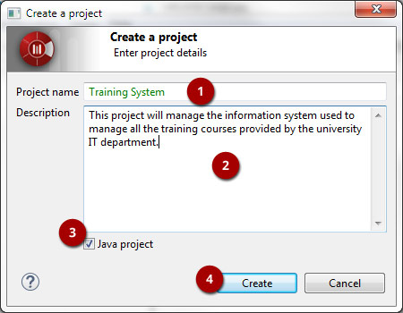
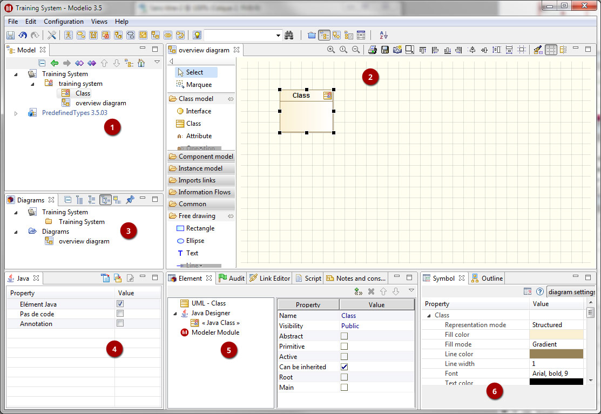
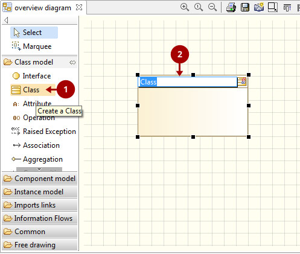
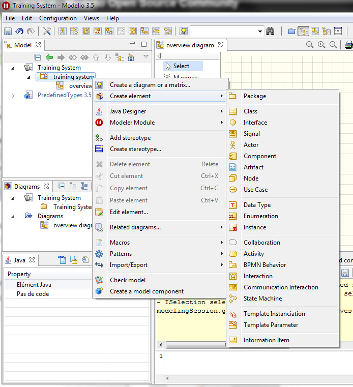
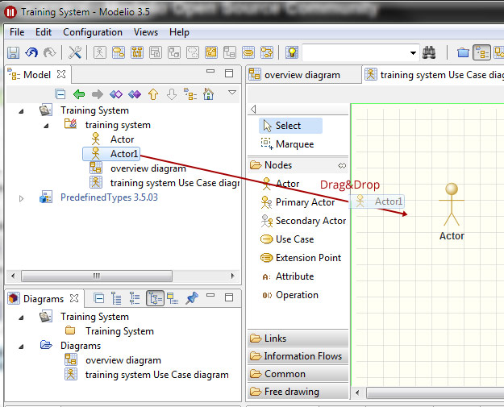
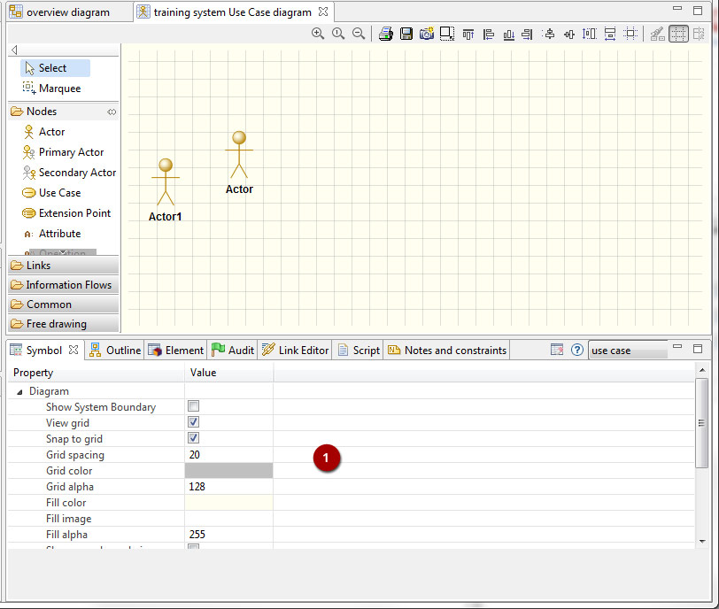
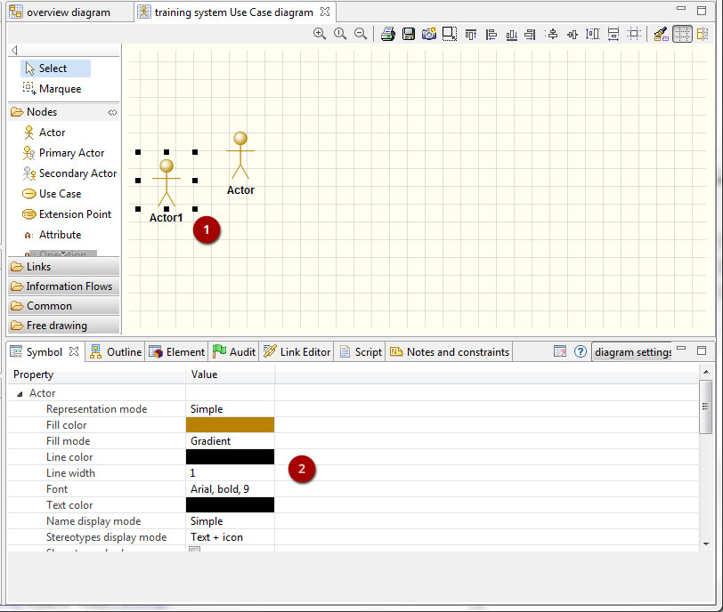

Modelio is a modeling solution offering a wide range of functionalities based on the main standards of enterprise architecture, software development and systems engineering.

Dedicated to developers, analysts and software and systems architects, Modelio is first and foremost a modeling environment, supporting a wide range of models and diagrams and providing many services facilitating the modeling of your architectures such as as model consistency checking features. Support for modeling and business processes (BPMN) is integrated into Modelio. These BPMN models can be linked to other standards supported by the tool, for example UML, so as to integrate these business processes into a larger context such as an enterprise architecture.
**https://www.modelio.org**

</table>
<table>
<tr>
<td>

# Main Features

* **UML Modeler** : Modelio is a first and foremost a modeling environment, supporting a wide range of models and diagrams, and providing model assistance and consistency checking features.
* **BPMN support** integrated with UML : Modelio combines BPMN support and UML support in one tool, with dedicated diagrams to support business process modeling.

* **Java code generator** : The Java Designer module uses an RCP/Eclipse-style project file structure, and supports Java code generation and reverse, Javadoc generation and Java automation.
* **XMI import/export** : Modelio provides an XMI import/export feature that enables you to exchange UML2 models between different tools.
* **HTML model publishing** : With the HTML Publisher module, publish your models in HTML format.
* **Extension system** : Modelio can be extended for any language, methodology or modeling technique just by adding modules to your configuration. You can either use existing modules or else develop your own.
* **Scripting language support (Jython)** : Modelio provides integrated support of the Jython scripting language, for online requests, small scripts and macro definition. 

</td>
<td>

# Supported Standards
* **UML2** : UML2 is a general-purpose modeling language from the OMG, used in the field of object-oriented software engineering.
* **BPMN2** : BPMN is a standard for business process modeling, providing a graphical notation for the specification of business processes.
* **Archimate** : Archimate is an open and independent enterprise architecture modeling language to support the description, analysis and visualization of architecture within and across business domains. 
* **XMI** :XMI is an OMG standard used in the exchange of metadata information via the XML language.
* **MDA** : MDA is an OMG standard, which implements and uses model extensions in the development of software systems.
* **TOGAF** :TOGAF is an enterprise architecture framework, providing a complete approach to enterprise information architecture design, planning, implementation and governance.

</td>
</tr>
</table>

# Build form Source
To understand how to compile the Modelio Modeling tool form source, please refer to the [Building Modelio from Source Guide](https://github.com/ModelioOpenSource/Modelio/wiki/Build-Modelio-Index).This guide explains how build the Modelio application form provided sources.

# Contribution

There are many ways to get involved in the Modelio community, on whatever level you choose. For each type of contribution, we recommend a certain level of knowledge as a user (someone who has some knowledge of the Modelio tool, as well as modeling or standards such as UML, SOA, BPM, ...) or a developer (someone with some knowledge of programming)

For more information, visit our community web page : 

# Quick Start Guide

Creating a project 
------------------

First you have to start Modelio by double-clicking on the Modelio shortcut.
Once Modelio is started, go to 'File / Create a project...' or click on the [] button. This will open a Project Creation dialog box:

Steps:

1. Enter a project name
2. Enter a description
3. You can choose to deploy the Java Designer module in your project by checking or not checking the Java project tickbox.
4. Click on "Create"

General User Interface
----------------------

Key:

1. Model explorer (UML, BPMN, MDA, Requirements, ...)
2. Diagram view
3. Diagrams explorer
4. Module view
5. Properties view
6. Symbol view

Key:

1. Save
2. Undo/Redo
3. Project Configurator: Project information, Work models, Libraries, Modules, Audit, URLs
4. Quick diagram creation
5. Diagram creation wizard
6. Advanced search tool
7. Perspectives: Change the layout of the views
8. Sort model elements

Creating elements
-----------------

**From the diagram view**

Key:

1. Choose the type of element you want to create from the diagram palette

2. Click in the diagram to position the new element. Click again on the element to rename it (or click on the F2 keyboard button)

**From the UML model explorer**

To create your first element, right-click on the root package and then on 'Create element'. Choose the kind of UML/BPMN element you want to create:

 

**Sibling creation**

To create a series of elements, simply select the original element in the model explorer, then click on sibling button as many times as necessary. Each new element will be created empty and named with an incremental number. Sibling elements are created within the same container.

 
**Clone creation**

To clone an element, simply select it in the UML/BPMN explorer, then click on clone button as many times as necessary. Each new element will be created with the same sub-elements as the original one, and will be named the same.

Creating diagrams
-----------------

** Diagram creation**
Click on the Diagram and matrix creation wizard icon in the main toolbar:

Steps:

1. Select the kind of diagram you want to create

3. Enter a name

4. Select an owner for the diagram

5. Click on "OK" to create the diagram

Note: By default, the wizard shows the applicable diagrams for the selected model element. Click on the "Show only applicable diagrams and matrices" to show all existing diagrams.

**Create elements in the diagram**

To create elements in your diagram, you can either use the left hand side palette, or drag&drop existing elements from the UML explorer.

**Modify the graphic options**

You can change the objects' graphic properties or the diagram's properties itself. The symbol view offers several options to change the graphic properties: color, font, line background, ...

Key:

1. Change the options in the Symbol view

**Change objects' graphic properties**

Key:

1. Select a graphic element

2. Change the options in the Symbol view

